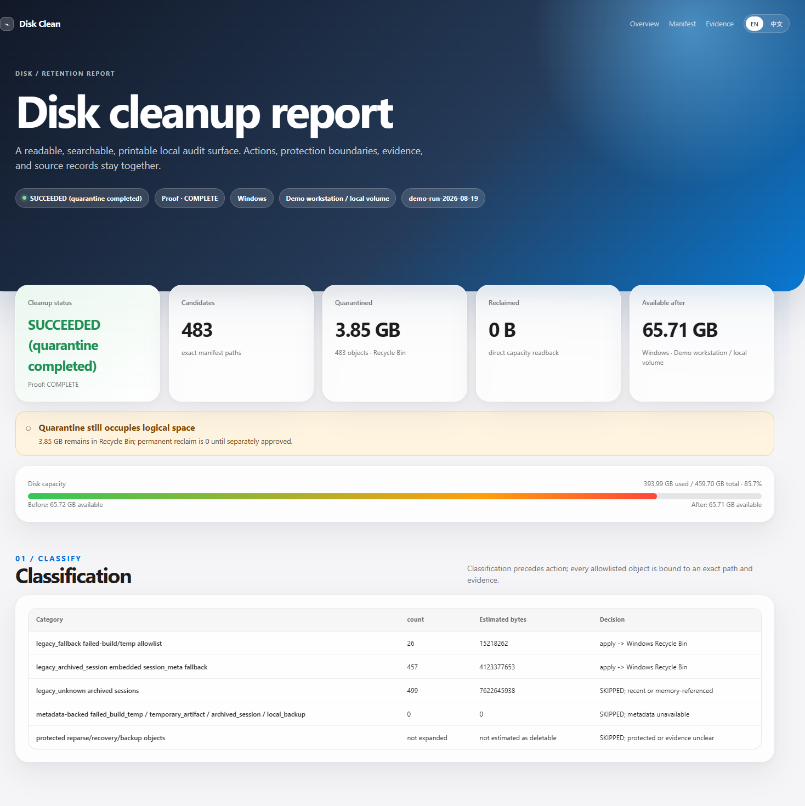
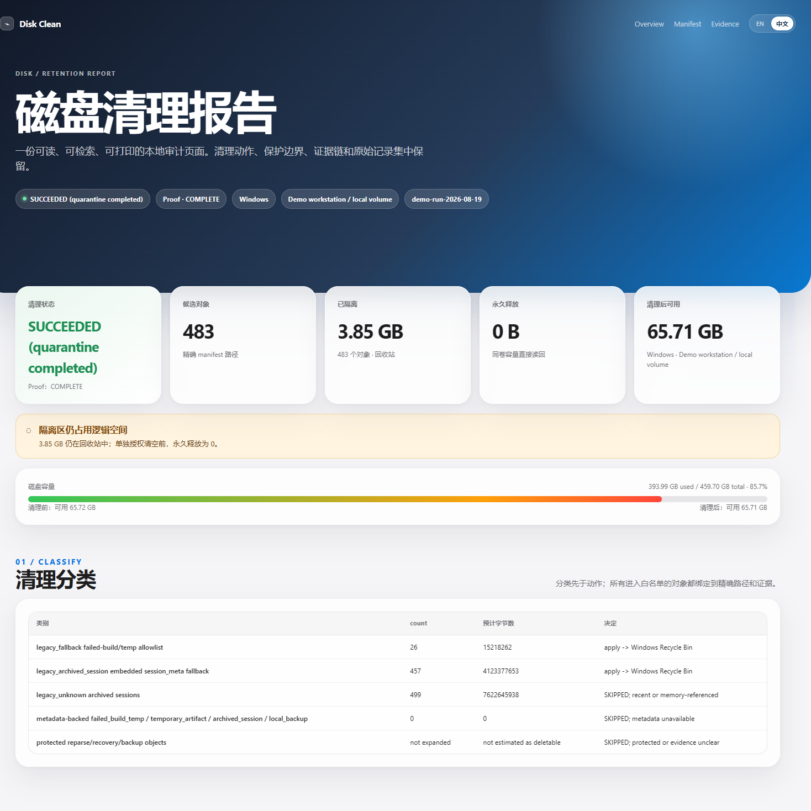

# Disk Clean

Portable, evidence-first disk cleanup for Windows, Linux, and macOS.

> Disclaimer: This is a high-permission cleanup skill. It does not guess paths or delete by
> age alone. It requires explicit target boundaries, a dry-run, an exact allowlist, and
> same-target action-after readback. Quarantine may still occupy disk space, and this tool is
> not a backup or recovery plan.

## Install

Clone the repository, then register the folder with your agent's skill loader:

~~~bash
git clone https://github.com/rwang23/disk-clean-skill.git
~~~
The folder must be installed as a skill named disk-clean and must contain the root file
SKILL.md. If your agent supports GitHub Skills, install this repository directly as a Skill.

## Run it with an agent

Copy this prompt to your agent and replace the placeholders:

~~~text
Use the disk-clean skill. I explicitly authorize the cleanup workflow for exactly the platform and target roots below. Start with read-only inventory and a dry-run, show the exact allowlist, estimated bytes, protected objects, and skip reasons, and apply only after I confirm that allowlist. Do not guess paths and do not touch active work, current releases, databases, backups, volumes, virtual disks, user profiles, or unknown objects. Use the platform quarantine/recycle adapter, perform same-target action-after readback, and generate the English and Chinese Markdown reports plus the self-contained HTML report. Platform: <windows|linux|macos>. Target roots: <absolute paths>. Report directory: <absolute path>. Metadata directory: <absolute path>. Actor: <configured owner>. Quarantine: <native-trash|same-volume-quarantine>.
~~~

## What it produces

Every run writes non-overwriting artifacts under the caller-provided report directory:

~~~text
disk-analysis-<run_id>.en.md
disk-analysis-<run_id>.zh-CN.md
disk-cleanup-<run_id>.en.md
disk-cleanup-<run_id>.zh-CN.md
disk-clean-report-<run_id>.html
~~~

The HTML report defaults to English, switches to Chinese in-page, and preserves the complete
manifest and source evidence. The full policy is in [SKILL.md](SKILL.md); Chinese guidance is in
[README.zh-CN.md](README.zh-CN.md).

## Safety boundary

The skill may classify failed builds, terminal temporary artifacts, expired archived sessions,
verified old backups, caches, and approved release artifacts. It keeps active work, current
releases, recovery evidence, databases, volumes, virtual disks, user profiles, and uncertain
objects untouched. Permanent deletion is not a substitute for a backup or restore test.

## Report preview

These public-safe previews show the report through the Classification section. Candidate paths,
session details, backup details, and later evidence sections are intentionally omitted.

## Validation

From the skill directory:

~~~text
python -c "import ast, pathlib; ast.parse(pathlib.Path('scripts/render_report_html.py').read_text())"
~~~
